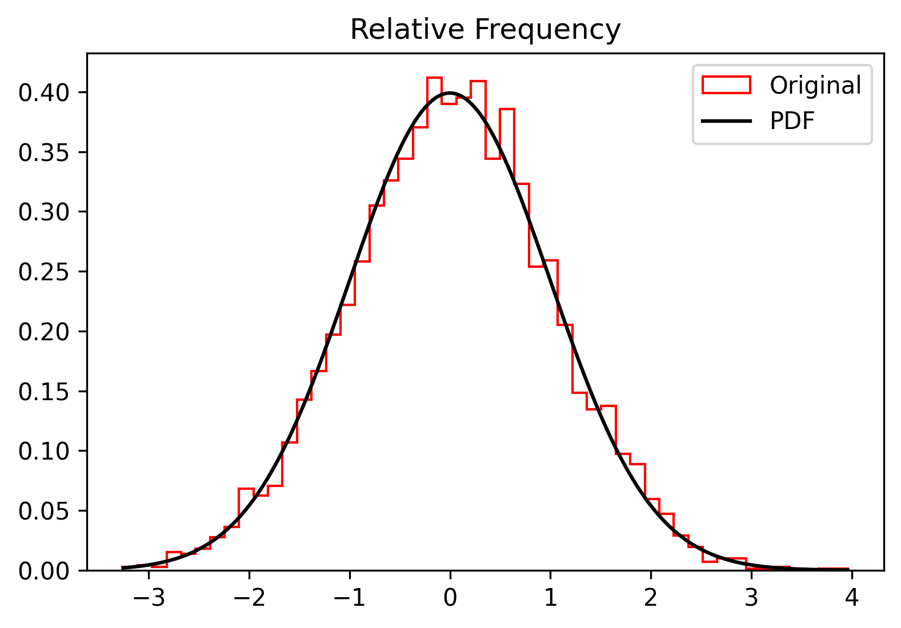
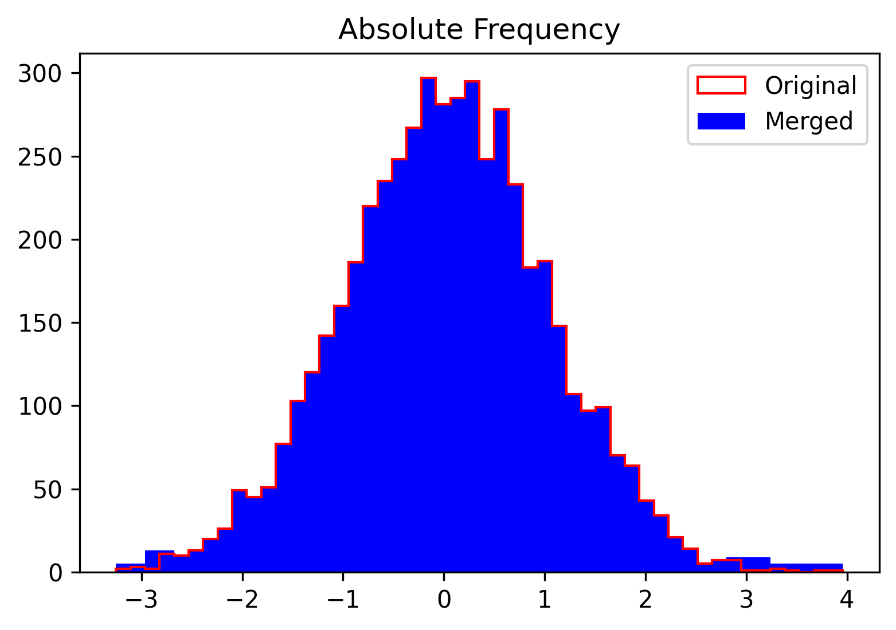

# A Simple Python Module for $\chi^2$ Goodness-of-fit Test

## Disclamier
This module should preferably be used to test unimodal distributions.

## Theoretical Primer
Let $X$ be a scalar random variable. Upon an adequate number of tests $n$ we wish to ascertain wether X follows a certain underlying distribution we hypothesise, $\mathcal{D}$. Upon an adquated number of samples, $N$, we wish to ascertain whether $X$ follows a distribution we hypothesise _a priori_. Generally, this is accomplished by setting out the so called $\chi^2$, or _goodness-of-fit_ test. Let us formalise the structure of such test:

$$\begin{cases} H_0:\ X \sim \mathcal{D} \\
H_1:\ X\nsim \mathcal{D}\end{cases}$$

Let us partition the samples $N$ into $M$ bins (or classes):

$$ \mathcal{K}_i\ \forall i=1,2,\dots, M$$

so that each bins is characterised by an _observed numerosity_ $\mathcal{O}_{i}$. Alongside, we can compute the _theoretical numerosity_ for each bin:

$$ \mathcal{E}_i = N\cdot \mathbb{P}[X\in\mathcal{X}_i]$$

As the best practice suggests, should the i-th class have $\mathcal{O}_i < 5$, such a class should be merged with its left or right neighbours. If this adjustment is not done, the denominator of $U$ might become far too high for the i-th class, thus eventually leading to huge, yet unjustified values of $U$. As widely employed for this kind of test, we adopt the following _test statistic_:

$$ U = \sum_{i  = 1}^{k}\frac{(\mathcal{O}_i - \mathcal{E}_i)^2}{\mathcal{E}_i} $$

It is widely known that, under $H_0$, $U\sim \chi^2_l$ where $l$ is the number of degrees of freedom, computed as

$$ l = N - 1 - P$$

where $P$ is the number of parameters _estimated from the sample_. If we do not estimate any parameter, then $P=0$. For instance, if $\mathcal{D}$ is hypothesised as a Normal distribution whose mean and variance are estimated from the given sample, then $P = 2$.

In order to accomplish the test we need to set a significativity level thereof: $\alpha$. Next, we computed the $1-\alpha$ quartile of a $\chi^2$ distribution having $l$ degrees of freedom, namely $\chi^2_{1-\alpha, l}$. Finally, the last check:

$$\begin{cases} U <  \chi^2_{1-\alpha, l}\ \text{do not reject}\ H_0\\
U > \chi^2_{1-\alpha, l}\ \text{reject}\ H_0\end{cases} $$


## Example

First we need to import the necessary modules.

```python
from pygof.test import chi2test
from pygof.binning import re_bin
from pygof.util import random_variable, inspect_sample

import scipy.stats
import numpy as np
np.random.seed(1) # for repeatability
```

If we just wish to include the package without installing it, we need to include this as well:

```python
import sys
sys.path.append("../src/")
```

Assume that our sample has 5000 items, grouped in 50 bins:

```python
sample_size = 5000
num_bins = 50
```

We define a standardised Normal random variable whereby we generate a sample onto which we shall perform the $\chi^2$ test. To do so, we invoke `scipy` functions to define the random variable and we then generate a sample. Since we already known the distribution governing the sample we should be getting just a confirmation! Needless to say, this sample can be replaced with a real sample of a case study.

```python
rv = random_variable(scipy.stats.norm, loc=0, scale=1)
sample = rv.rvs(size=sample_size)
```

As mentioned earlier, each bin must contain at least 5 items to conduct a meaninful $\chi^2$ test. So we assume a bin capacity threshold of 5, `th=5`, and rebin the sample by:

```python
merged_counts, merged_edges, merged_edges_plot = re_bin(sample, n_bins=num_bins, th=th)
```

where `merged_edges_plot` are returned only for visualisation purposes. Finally the $\chi^2$ at $\alpha = 5\%$:

```python
chi2test(merged_counts, merged_edges, rv, signif=10, est_params=True)
```

provides the results we anticipated:

```txt
------------------------------------------------------------
Number of samples: 5000
Number of bins: 42
Number of Degrees of Freedom (DoFs): 39
Number of Estimated Parameters: 2
Significativity = 10.00%
Chi2 from data = 36.45
Chi2 from function = 50.66
Chi2 test PASSED (data < function)
------------------------------------------------------------
```

We can also inspect the sample:

```python
inspect_sample(sample, n_bins=num_bins, rv=rv, density=True)
```



and the results:

```python
inspect_sample(sample, n_bins=num_bins, rv=rv, density=False,
                       new_counts=merged_counts, new_edges=merged_edges_plot)
```


